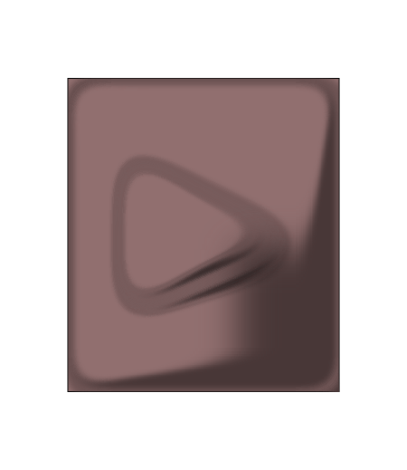
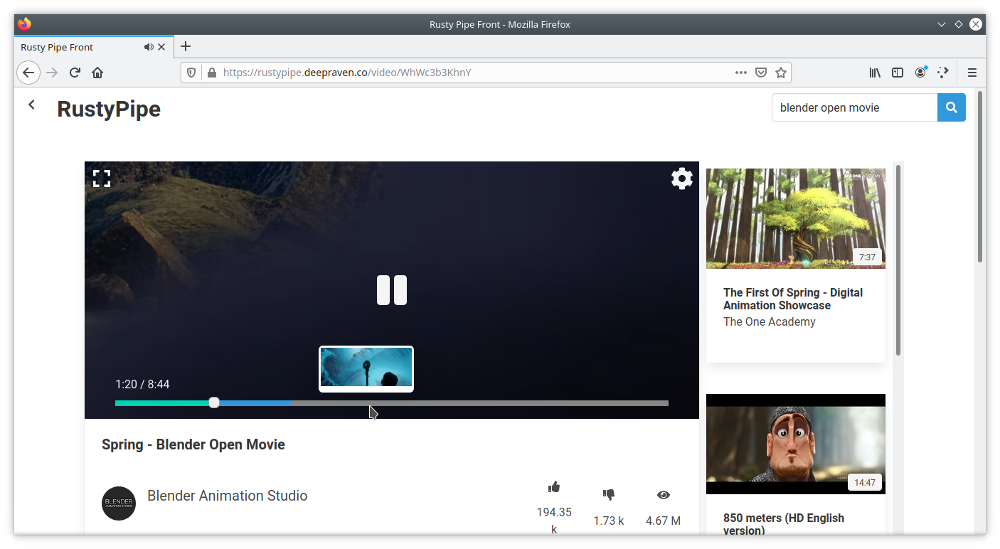
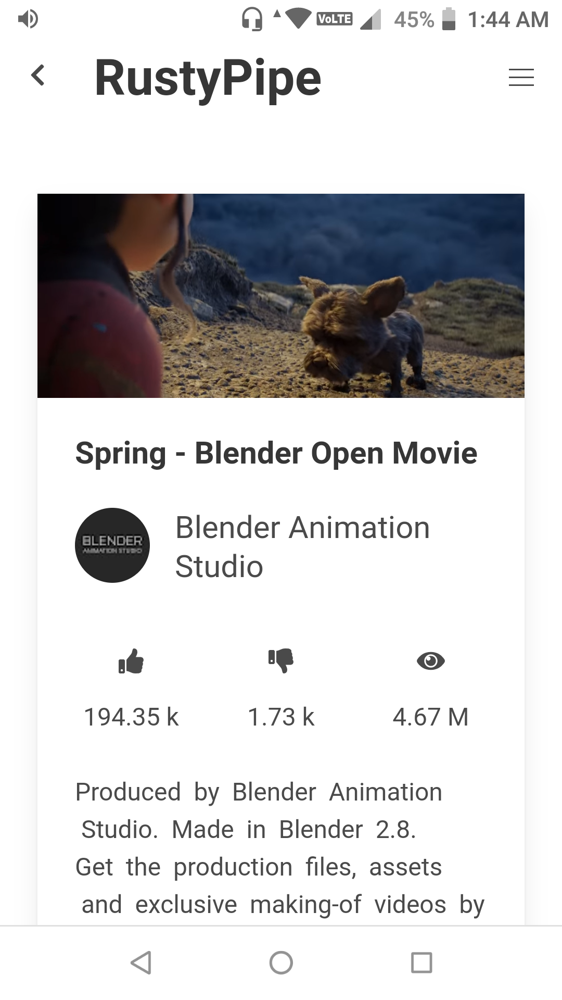

 
<h2 align="center"><b>Rusty Pipe</b></h2>
<h4 align="center">An alternate youtube frontend</h4>

<a href="https://rustypipe.deepraven.co/">rustypipe.deepraven.co</a>
 

## Screenshots

## Description

Rustypipe is aims to be a modern front end to youtube made in rust. It tries not to rely on any server side processing and perform all extraction on client side in form of a Progressive Web App.

### Features

* Picture in Picture Support
* MediaSession API Support
* Custom video player
* Previews in video player
* Support for av1 video codec
* Search Youtube
* Background Playback
* Notification Control

## Donate
Donation of any kind is appreciated :)

<table>
  <tr>
    <td><a href="https://www.buymeacoffee.com/deepgaurav">Buymeacoffee</a></td>
    <td></td>
    <td><a href="https://www.buymeacoffee.com/deepgaurav">Donate with buymeacofee</a></td>
  </tr>
  <tr>
    <td></td>
    <td></td>
    <td><a href="https://paypal.me/deepgaurav">Paypal Me!</a></td>
  </tr>
</table>

## Privacy Policy

RustyPipe is commited to keep user data secure and so does not collect any form of data from user.

## License
  

MusicPiped is Free Software: You can use, study share and improve it at your
will. Specifically you can redistribute and/or modify it under the terms of the
[GNU General Public License](https://www.gnu.org/licenses/gpl.html) as
published by the Free Software Foundation, either version 3 of the License, or
(at your option) any later version.  
